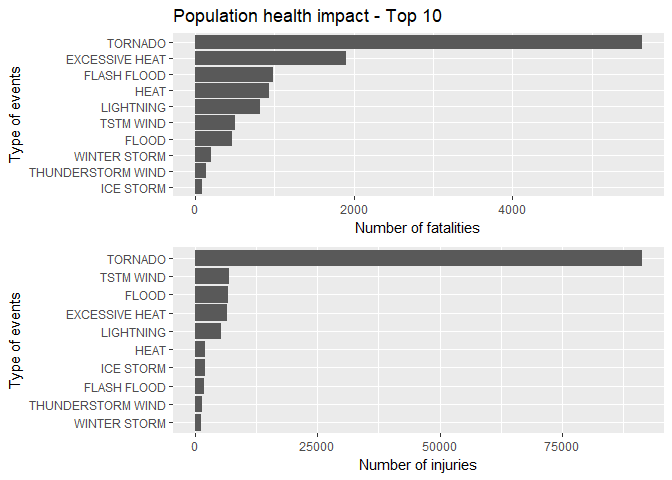
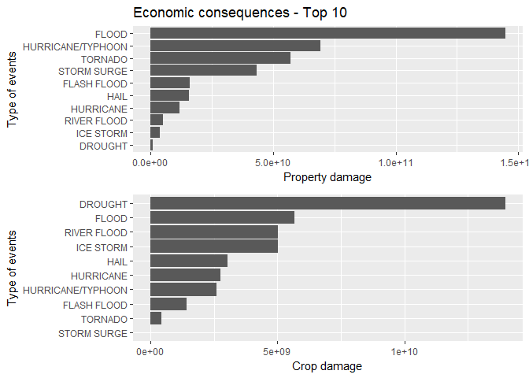

# Impact of major storms and weather events in the United States analysis
Charles  
July 21, 2017  


## Synopsis
- Subset dataset by certain columns that we need.
- Sum up fatalities and injuries for every event type and plot bar chart to see
top ten events that are most harmful with respect to population health.
- Transform the magnitude of damage into corresponding scale and compute the property
and crop damage.
- Sum up property and crop damage for every event type and plot bar chart to see
top ten events that have the greatest economic consequences.

## Data Processing
Firstly we download data and read data.


```r
file.url="https://d396qusza40orc.cloudfront.net/repdata%2Fdata%2FStormData.csv.bz2"
file.name="repdata%2Fdata%2FStormData.csv.bz2"
if (!file.exists("repdata%2Fdata%2FStormData.csv.bz2")){
        download.file(file.url,file.name)
}
dataStorm <- read.csv("repdata%2Fdata%2FStormData.csv.bz2", na.strings = "NA")
```

Set up libraries:

```r
library(dplyr)
library(ggplot2)
library(gridExtra)
library(grid)
```

According to our question, we only need columns corresponding to event types,
population health and economic consequences.
So we subset the dataset using `EVTYPE,FATALITIES,INJURIES,PROPDMG,PROPDMGEXP,CROPDMG,CROPDMGEXP`:


```r
columnsKeep <- c("EVTYPE","FATALITIES","INJURIES","PROPDMG","PROPDMGEXP","CROPDMG","CROPDMGEXP")
dataSub <- select(dataStorm, columnsKeep)
```

Then we need to transform the magnitude of damage into corresponding scale.
`H` stands for hundreds, `K` for thousands, `M` for millions, `B` for billions.


```r
indexProperty <- NA
index <- grep("H|h",dataSub$PROPDMGEXP)
indexProperty[index] <- 1e2
index <- grep("K|k",dataSub$PROPDMGEXP)
indexProperty[index] <- 1e3
index <- grep("M|m",dataSub$PROPDMGEXP)
indexProperty[index] <- 1e6
index <- grep("B|b",dataSub$PROPDMGEXP)
indexProperty[index] <- 1e9
indexProperty[is.na(indexProperty)] <- 0

indexCorp <- NA
index <- grep("H|h",dataSub$CROPDMGEXP)
indexCorp[index] <- 1e2
index <- grep("K|k",dataSub$CROPDMGEXP)
indexCorp[index] <- 1e3
index <- grep("M|m",dataSub$CROPDMGEXP)
indexCorp[index] <- 1e6
index <- grep("B|b",dataSub$CROPDMGEXP)
indexCorp[index] <- 1e9
indexCorp[is.na(indexCorp)] <- 0
```

where we get `indexProperty` for scale of property damage and
`indexCorp` for scale of crop damage.
Then we compute the actual property damage and crop damage.
Also we get total population health impact by sum fatalities and injuries.


```r
dataRecal <- dataSub %>%
        mutate(totalInjury = FATALITIES+INJURIES) %>%
        mutate(indexOfProperty = indexProperty) %>%
        mutate(indexOfCrop = indexCorp) %>%
        mutate(totalProperty = PROPDMG * indexOfProperty) %>%
        mutate(totalCrop = CROPDMG * indexOfCrop) %>%
        mutate(totalDamage = totalProperty + totalCrop)
head(dataRecal)
```

```
##    EVTYPE FATALITIES INJURIES PROPDMG PROPDMGEXP CROPDMG CROPDMGEXP
## 1 TORNADO          0       15    25.0          K       0           
## 2 TORNADO          0        0     2.5          K       0           
## 3 TORNADO          0        2    25.0          K       0           
## 4 TORNADO          0        2     2.5          K       0           
## 5 TORNADO          0        2     2.5          K       0           
## 6 TORNADO          0        6     2.5          K       0           
##   totalInjury indexOfProperty indexOfCrop totalProperty totalCrop
## 1          15            1000           0         25000         0
## 2           0            1000           0          2500         0
## 3           2            1000           0         25000         0
## 4           2            1000           0          2500         0
## 5           2            1000           0          2500         0
## 6           6            1000           0          2500         0
##   totalDamage
## 1       25000
## 2        2500
## 3       25000
## 4        2500
## 5        2500
## 6        2500
```

## Results
### Question 1
For question 1, we sum up total fatalities and total injuries for every event type.
Show the results in descending order:


```r
dataForHealth <- dataRecal %>%
        group_by(EVTYPE) %>%
        summarise(numFatalities = sum(FATALITIES),
                  numInjuries = sum(INJURIES),
                  numTotal = sum(totalInjury)) %>%
        arrange(desc(numTotal))
dataForHealth <- as.data.frame(dataForHealth)
head(dataForHealth)
```

```
##           EVTYPE numFatalities numInjuries numTotal
## 1        TORNADO          5633       91346    96979
## 2 EXCESSIVE HEAT          1903        6525     8428
## 3      TSTM WIND           504        6957     7461
## 4          FLOOD           470        6789     7259
## 5      LIGHTNING           816        5230     6046
## 6           HEAT           937        2100     3037
```

Then we use bar chart to plot top 10 event types that are most harmful with respect 
to population health:


```r
g1 <- ggplot(head(dataForHealth,10), aes(x=reorder(EVTYPE,numFatalities),y=numFatalities))
q1 <- g1 + geom_bar(stat = "identity") +
        coord_flip() +
        ggtitle("Population health impact - Top 10") +
        ylab("Number of fatalities") +
        xlab("Type of events")
g2 <- ggplot(head(dataForHealth,10), aes(x=reorder(EVTYPE,numInjuries),y=numInjuries))
q2 <- g2 + geom_bar(stat = "identity") +
        coord_flip() +
        ylab("Number of injuries") +
        xlab("Type of events")
grid.arrange(q1,q2,nrow=2)
```

<!-- -->

As we can see above, tornado are most harmful with respect to population health.

### Question 2
For question 2, we sum up property damage and crop damage according to different event
types:


```r
dataForEco <- dataRecal %>%
        group_by(EVTYPE) %>%
        summarise(numProperty = sum(totalProperty),
                  numCrop = sum(totalCrop),
                  numTotal = sum(totalDamage)) %>%
        arrange(desc(numTotal))
dataForEco <- as.data.frame(dataForEco)
head(dataForEco)
```

```
##              EVTYPE  numProperty    numCrop     numTotal
## 1             FLOOD 144657709800 5661968450 150319678250
## 2 HURRICANE/TYPHOON  69305840000 2607872800  71913712800
## 3           TORNADO  56937160480  414953110  57352113590
## 4       STORM SURGE  43323536000       5000  43323541000
## 5              HAIL  15732267220 3025954450  18758221670
## 6       FLASH FLOOD  16140811510 1421317100  17562128610
```

Then use bar chart to plot the top 10 event types that have the greatest economic 
consequences:

```r
g1 <- ggplot(head(dataForEco,10), aes(x=reorder(EVTYPE,numProperty),y=numProperty))
q1 <- g1 + geom_bar(stat = "identity") +
        coord_flip() +
        ggtitle("Economic consequences - Top 10") +
        ylab("Property damage") +
        xlab("Type of events")
g2 <- ggplot(head(dataForEco,10), aes(x=reorder(EVTYPE,numCrop),y=numCrop))
q2 <- g2 + geom_bar(stat = "identity") +
        coord_flip() +
        ylab("Crop damage") +
        xlab("Type of events")
grid.arrange(q1,q2,nrow=2)
```

<!-- -->

As we can see above, flood and drought have the greatest economic consequences.


